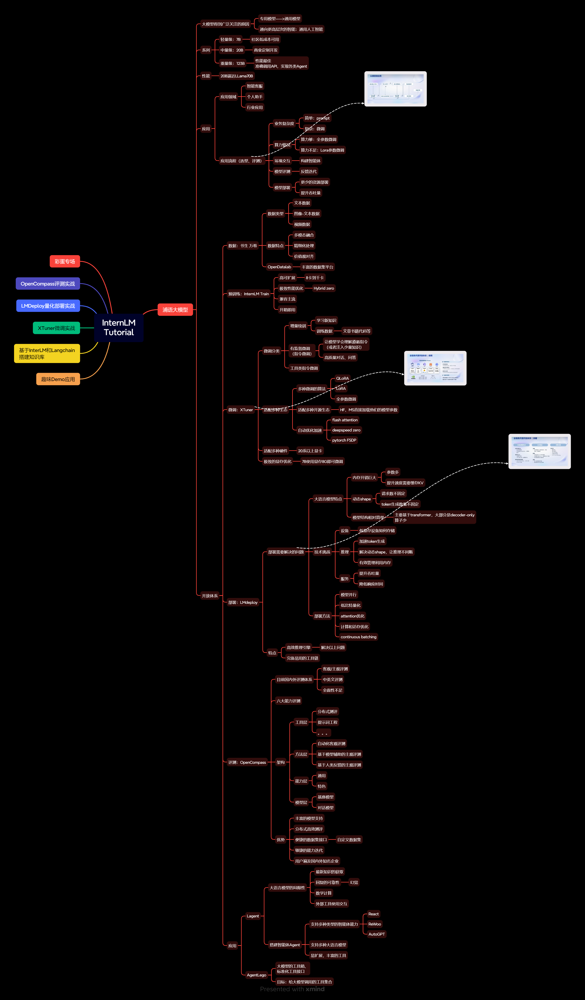

# InternLM实战笔记
#### 笔记层次按照几次课的顺序顺次排列，笔记主要采用脑图形式。
## lesson1：书生·浦语大模型全链路开源体系
### **LLM整体脉络梳理**
- 本节最大收获是通过InternLM的开源链路体系，从整体上认识了大模型应用的各个领域
- 数据类型及处理-->预训练-->微调-->部署-->评测-->应用（Agent）
- 以上整体链路中需要关注的问题，以及目前采用的常见解决办法（见思维导图）

### **书生·浦语针对以上流程的工具**
- 书生 万卷--> InternLMTrain--> XTuner--> LMdeploy --> OpenCompass --> Lagent(详见脑图)

